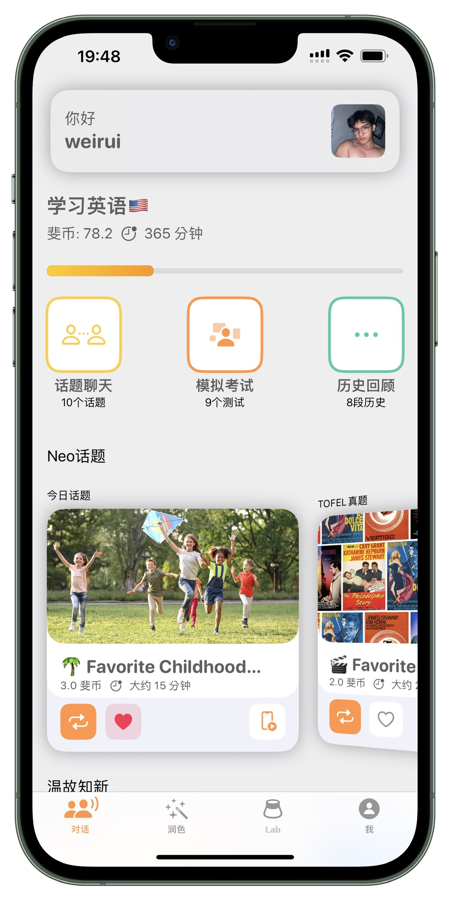
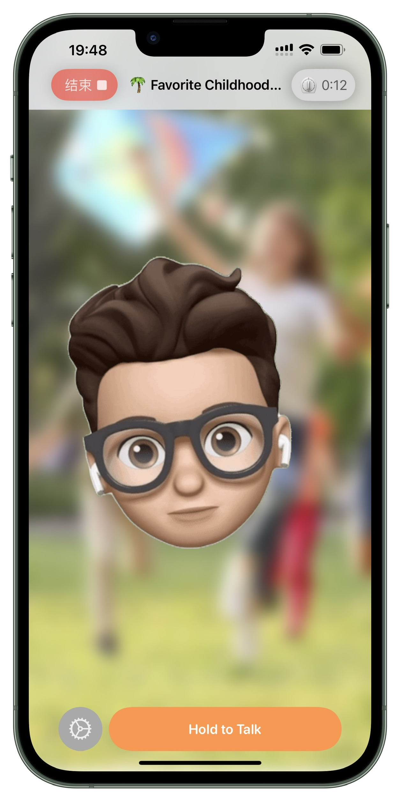
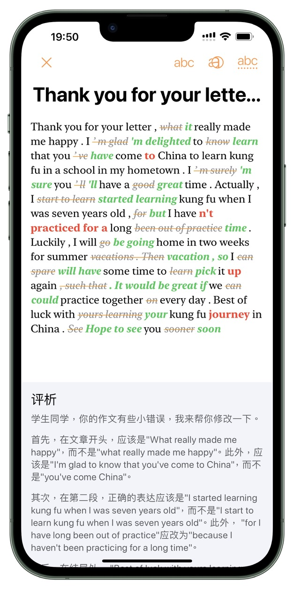

# Sophia-Neural
An iOS app combining my two former projects, Sophia and Hablar, that can run LLM models locally or remotely. You can chat with them and write to them, receiving natural responses.

- 一款结合了我之前两个项目Sophia和Hablar的iOS应用，可以本地或远程运行LLM模型。您可以与它们聊天并给它们写信息，获得自然的回应。

- 私の以前の2つのプロジェクト、SophiaとHablarを組み合わせたiOSアプリで、LLMモデルをローカルまたはリモートで実行できます。彼らとチャットしたり、メッセージを書いたりすることができ、自然な応答を受け取ります。

First public beta may be avaliable later this year.

- 首次公开测试版可能将在今年晚些时候推出。

- 最初の公開ベータ版は、今年後半に利用可能になるかもしれません。

## About formerly `Sohpia`

Please refer to [https://blog.onespirit.fyi/index.php/resume/](https://blog.onespirit.fyi/index.php/resume/#:~:text=Server%2DMonitor%2DApp-,Sophia%EF%BC%88%E8%AF%B4%E6%96%90%EF%BC%89,-%E5%85%A8%E6%A0%88%2BiOS)

|Home|Talk|Revise|
|-|-|-|
||||